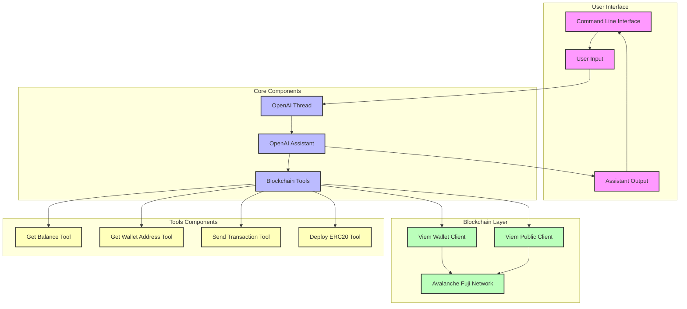

# Application Architecture

## System Components and Flow

The following diagram illustrates the high-level architecture of the AI-OnChain-Agent:

## Architecture Explanation

### 1. User Interface Layer
- **Command Line Interface (CLI)**: The primary interface for user interaction
- **User Input**: Processes natural language commands from users
- **Assistant Output**: Displays responses and transaction results

### 2. Core Components
- **OpenAI Assistant**: Processes natural language and determines required actions
- **OpenAI Thread**: Maintains conversation context and history
- **Blockchain Tools**: Bridge between AI and blockchain operations

### 3. Blockchain Layer
- **Viem Wallet Client**: Handles authenticated blockchain transactions
- **Viem Public Client**: Manages read-only blockchain operations
- **Avalanche Fuji Network**: Target blockchain network for all operations

### 4. Tools Components
Each tool is designed for specific blockchain operations:

#### Read Operations
- **Get Balance Tool**
  - Queries wallet balances
  - Uses public client for read operations
  - Returns formatted balance information

- **Get Wallet Address Tool**
  - Retrieves connected wallet address
  - Uses wallet client for authentication
  - Returns checksummed address

#### Write Operations
- **Send Transaction Tool**
  - Handles ETH transfers and contract interactions
  - Supports advanced transaction parameters
  - Manages gas pricing and transaction confirmation

- **Deploy ERC20 Tool**
  - Deploys new ERC20 token contracts
  - Handles token configuration
  - Manages contract deployment process

## Data Flow

1. User inputs commands through the CLI
2. Commands are processed by the OpenAI Assistant
3. Assistant determines required blockchain operations
4. Appropriate tools are called with necessary parameters
5. Tools interact with the blockchain through Viem clients
6. Results are returned through the component chain
7. Formatted responses are displayed to the user

## Security Considerations

- Private keys are managed securely through environment variables
- Sensitive operations require explicit user confirmation
- All blockchain interactions are performed on the Fuji testnet
- Transaction parameters are validated before execution
